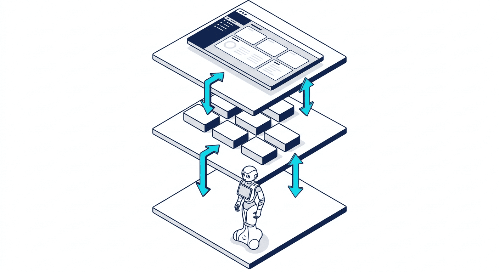
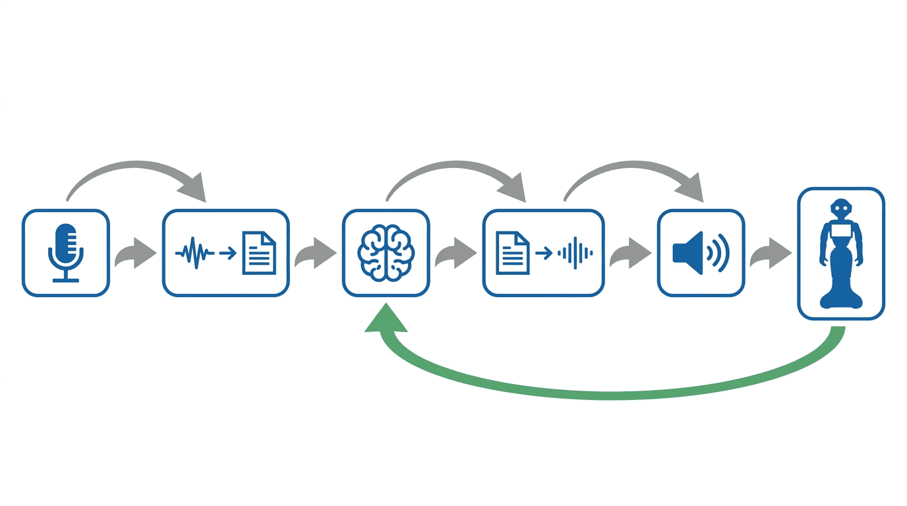
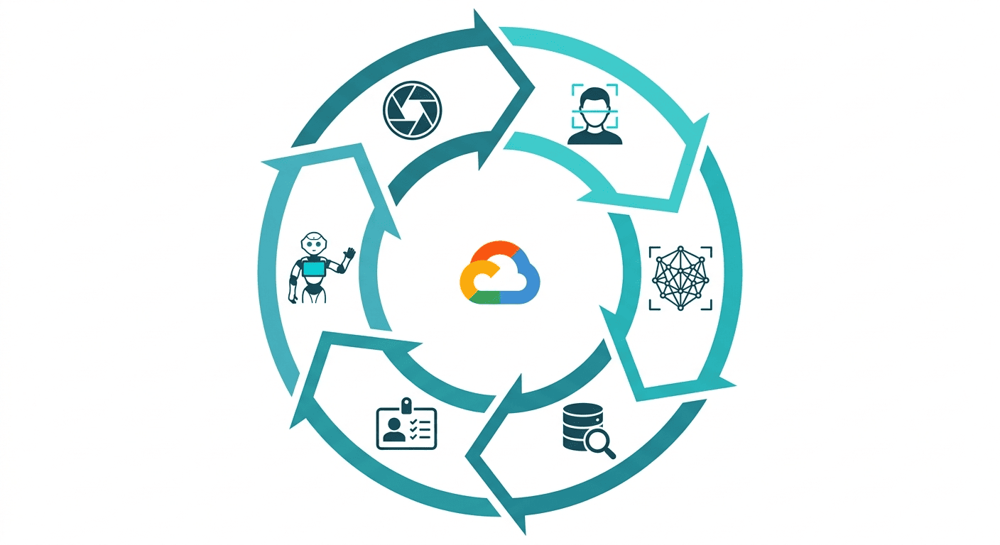

# 🤖 Pepper Robot Management System

> **A Cost-Effective Cloud-Offloading Architecture for Human-Robot Interaction**  
> Integrating LLMs and Computer Vision on Resource-Constrained Humanoid Robots

[](LICENSE)
[](https://www.python.org/)
[](https://flask.palletsprojects.com/)
[](https://cloud.google.com/)
[](https://www.docker.com/)

**Author**: Gilang Hidayatullah

---

## Overview

Pepper robots are resource-constrained humanoid platforms with limited onboard compute. This project addresses that constraint through a **cloud-offloading architecture** — offloading heavy AI workloads (speech recognition, language understanding, face recognition) to Google Cloud services, while the robot handles physical interaction and I/O. The result is a full-stack system enabling real-time conversation, face-based identity recognition, and programmable movement — at a fraction of the cost of onboard processing.

The system is organized into three independently deployable microservices:

| Service | Folder | Purpose |
|---|---|---|
| Backend Management | `pepper-be/` | REST API, auth, robot control, admin UI |
| AI Conversation | `pepper-ai-discussion/` | Voice-based dialogue via Gemini + GCP STT/TTS |
| Face Recognition | `final test face reco app/` | Real-time face detection with cloud-synced database |

---

## Architecture



```
                          ┌─────────────────────────────────────┐
                          │           Google Cloud Platform      │
                          │  ┌──────────┐  ┌──────────────────┐ │
                          │  │  Vertex  │  │  Cloud Storage   │ │
                          │  │  AI      │  │  (face database) │ │
                          │  │ (Gemini) │  └──────────────────┘ │
                          │  └──────────┘  ┌──────────────────┐ │
                          │  ┌──────────┐  │  STT / TTS APIs  │ │
                          │  │Cloud Run │  └──────────────────┘ │
                          │  └──────────┘                       │
                          └────────────┬────────────────────────┘
                                       │ REST / gRPC
               ┌───────────────────────┼───────────────────────┐
               │                       │                       │
      ┌────────▼──────┐    ┌───────────▼──────┐    ┌──────────▼──────┐
      │  pepper-be    │    │pepper-ai-discussion│   │  face reco app  │
      │  Flask API    │    │  Flask + Docker   │    │  Flask + DeepFace│
      └───────┬───────┘    └─────────┬─────────┘    └────────┬────────┘
              │                      │                        │
              └──────────────────────┴────────────────────────┘
                                     │ SSH / NAOqi SDK
                                ┌────▼─────┐
                                │  Pepper  │
                                │  Robot   │
                                └──────────┘
```

---

## Services

### 1. Backend Management System (`pepper-be/`)

A Flask-based REST API that serves as the central control plane for the robot:

- JWT-authenticated user management and role-based access control
- Robot movement and choreography sequence management (walk, dance patterns)
- SSH-based command dispatch to the Pepper robot
- Face identity database management (linked to GCS)
- AI conversation session orchestration
- Web-based admin dashboard (Bootstrap, HTML/CSS/JS)
- Multi-language support (Indonesian / English)

**Stack:** Python 3.11, Flask, SQLAlchemy (SQLite), JWT, Google Cloud Storage

---

### 2. AI Conversation Service (`pepper-ai-discussion/`)

A voice-first dialogue service that gives Pepper natural language capabilities without onboard ML:

- Captures audio input → Google Cloud Speech-to-Text for transcription
- Sends transcript to Vertex AI (Gemini 2.0 Flash) for response generation
- Synthesizes response audio via Google Cloud Text-to-Speech
- Maintains per-session conversation history for multi-turn context
- Containerized and deployable to Cloud Run

**Stack:** Flask, Vertex AI (Gemini 2.0 Flash), Google Cloud STT/TTS, Docker



---

### 3. Face Recognition Service (`final test face reco app/`)

A real-time face recognition service backed by cloud-synced identity storage:

- Detects and identifies faces from live camera frames using DeepFace + VGGFace
- Stores and retrieves identity embeddings via Google Cloud Storage (no local DB required)
- Auto-syncs the local face cache with GCS on startup
- Exposes a REST API for robot integration

**Stack:** Flask, DeepFace, OpenCV, VGGFace, Google Cloud Storage



---

## Project Structure

```
pepper-robots/
├── pepper-be/                       # Backend management system
│   ├── app/
│   │   ├── controller/              # API route handlers
│   │   ├── model/                   # SQLAlchemy database models
│   │   ├── services/                # Business logic
│   │   ├── templates/               # Jinja2 web UI templates
│   │   ├── static/                  # CSS, JS, images
│   │   └── utils/                   # Shared utilities
│   ├── tests/                       # Unit and integration tests
│   └── docs/                        # API documentation
│
├── pepper-ai-discussion/            # AI conversation microservice
│   ├── app.py                       # Flask application entry point
│   ├── Dockerfile                   # Container build config
│   └── requirements.txt
│
├── final test face reco app/        # Face recognition microservice
│   ├── app.py                       # Flask application entry point
│   ├── gcs_handler.py               # Google Cloud Storage integration
│   └── pepper_client.py             # Pepper robot client library
│
├── .gitignore
├── AUTHORS
├── CITATION.cff
├── CONTRIBUTING.md
├── LICENSE                          # Apache 2.0
└── SECURITY.md
```

---

## Getting Started

### Prerequisites

- Python 3.11+
- A [Google Cloud Platform](https://cloud.google.com/) project with these APIs enabled:
  - Vertex AI API
  - Cloud Speech-to-Text API
  - Cloud Text-to-Speech API
  - Cloud Storage API
- A GCP service account key (JSON) with appropriate permissions
- Docker (for the AI conversation service)
- Access to a Pepper robot (optional — core services run without it)

---

### 1. Backend Management System

```bash
cd pepper-be
python -m venv venv
source venv/bin/activate          # Linux/macOS
# venv\Scripts\activate           # Windows

pip install -r requirements.txt
cp .env.example .env              # Fill in your credentials
python run.py
```

Key `.env` variables:

```env
SECRET_KEY=your_flask_secret
GCS_BUCKET_NAME=your_bucket
GOOGLE_APPLICATION_CREDENTIALS=path/to/service-account.json
PEPPER_HOST=192.168.x.x          # Robot IP (optional)
```

---

### 2. AI Conversation Service

**With Docker (recommended):**

```bash
cd pepper-ai-discussion
docker build -t pepper-ai .
docker run -p 5000:5000 \
  -e GOOGLE_APPLICATION_CREDENTIALS=/app/service-account.json \
  -v /path/to/service-account.json:/app/service-account.json \
  pepper-ai
```

**Without Docker:**

```bash
cd pepper-ai-discussion
pip install -r requirements.txt
python app.py
```

---

### 3. Face Recognition Service

```bash
cd "final test face reco app"
pip install -r requirements.txt
export GOOGLE_APPLICATION_CREDENTIALS=path/to/service-account.json
export GCS_BUCKET_NAME=your_bucket
python app.py
```

On startup, the service will sync the face database from GCS to a local cache automatically.

---

## API Reference

Each service exposes its own REST API. Refer to the individual README files in each subdirectory for full endpoint documentation:

- [`pepper-be/docs/`](pepper-be/docs/) — Backend management API
- [`pepper-ai-discussion/`](pepper-ai-discussion/) — Conversation service API
- [`final test face reco app/`](final%20test%20face%20reco%20app/) — Face recognition API

---

## License

Licensed under the [Apache License, Version 2.0](LICENSE).

Copyright 2026 Gilang Hidayatullah

---

## Citation

If you use this work in academic research, please cite:

```bibtex
@software{hidayatullah2026pepper,
  author    = {Hidayatullah, Gilang},
  title     = {Pepper Robot Management System: A Cost-Effective Cloud-Offloading
               Architecture for Human-Robot Interaction},
  year      = {2026},
  url       = {https://github.com/hidatara-ds/pepper-robots}
}
```

---

## Contributing

Contributions are welcome. Please read [CONTRIBUTING.md](CONTRIBUTING.md) before submitting a pull request.
